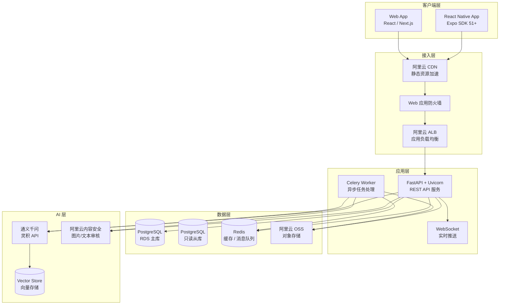
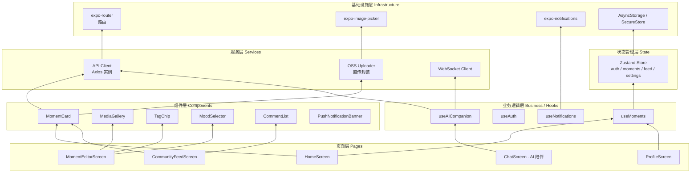
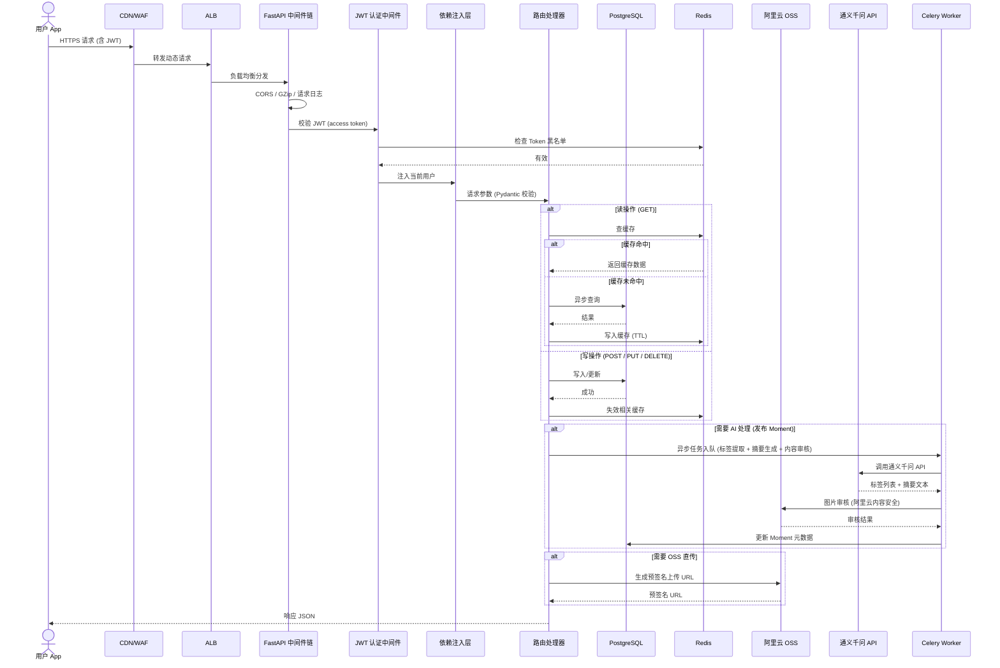
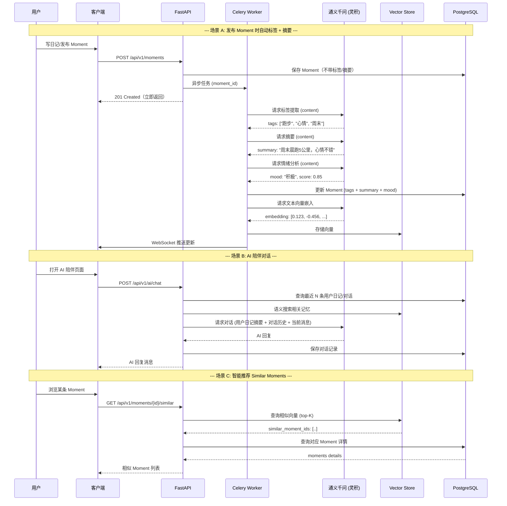
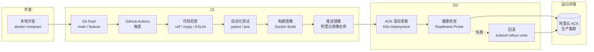
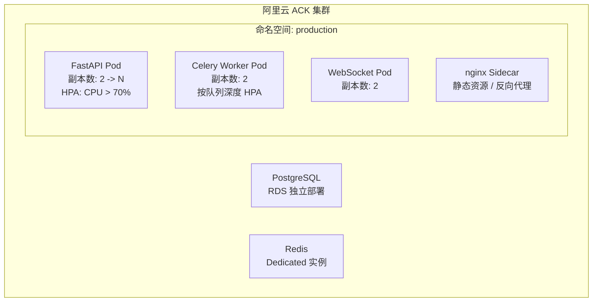

# ShengKe（生刻）系统架构

> 版本：v1.0 | 最后更新：2026-07-19

---

## 1. 产品定位概述

**ShengKe（生刻）** 是一款融合 **私密日记 + 选择性社区分享 + AI 智能陪伴** 的个人生活记录平台。

### 核心定位

| 维度 | 定位 |
|------|------|
| 私密性 | 日记默认仅自己可见，支持细粒度分享控制 |
| 社交性 | 可选择将 Moment 公开发布到社区，形成轻社交圈 |
| 智能性 | AI 自动提取标签、生成摘要、分析情绪、提供陪伴式对话 |

### 与现有产品的区别

- **朋友圈**：ShengKe 无社交压力——不要求点赞互动，不发即消失。默认为私密，分享是用户主动选择的行为。
- **小红书**：ShengKe 重叙事而非消费（种草/探店），没有商业化 KOL 生态，专注个人真实记录。
- **Day One / 纯私密日记类 App**：ShengKe 提供可选社区分享和 AI 智能分析，不是冷冰冰的纯本地存储。AI 陪伴让日记不再是单向倾诉。

### 目标用户

- 有记录习惯但不希望被社交绑架的人
- 希望被 AI 理解、陪伴的独居/独处人群
- 对数据隐私有要求、不想把日记放在社交平台上的用户

---

## 2. 整体架构分层

### 架构分层图



### 各层说明

#### 客户端层
客户端通过 React Native (Expo) 提供 iOS/Android 双端原生体验，Web 端作为辅助入口。所有请求经阿里云 CDN 缓存加速静态资源，动态请求穿透 WAF 安全防护后到达应用层。客户端仅持有短有效期 JWT，不存储敏感密钥。

#### 接入层
- **CDN**：加速图片、前端包、视频等静态资源的分发，降低源站压力。
- **WAF**：过滤 SQL 注入、XSS、CC 攻击等恶意流量。
- **ALB**：负责 TLS 终结、会话保持、健康检查和流量分发，后端挂载 FastAPI 实例组。

#### 应用层
- **FastAPI + Uvicorn**：异步非阻塞的 Python Web 框架，天然支持 async/await，配合 Pydantic v2 做严格的请求校验和数据序列化。
- **Celery Worker**：独立进程消费 Redis 队列中的异步任务（图片压缩、AI 标签提取、内容审核回调），避免阻塞 API 请求。
- **WebSocket**：用于实时推送通知（新评论、AI 陪伴消息等），通过 FastAPI 的 WebSocket 端点实现。

#### 数据层
- **PostgreSQL**：结构化核心数据（用户、Moment、评论、关系）。
- **Redis**：缓存热点数据（Feed 流、用户时间线）、存储 Session、作为 Celery 消息队列的 Broker/Backend。
- **OSS**：用户上传的图片和视频，通过预签名 URL 直传，服务端只做合法性校验。

#### AI 层
- **通义千问 API**：通过阿里云灵积平台调用，完成标签提取、摘要生成、情绪分析、智能对话等任务。
- **Vector Store**：存储 Moment 文本嵌入向量，用于语义搜索和内容推荐（similar moments）。
- **内容安全服务**：图片鉴黄、文本敏感词过滤，在用户发布 Moment 时自动触发。

---

## 3. 技术选型详述

### 3.1 前端：React Native + Expo

#### 技术栈
- **Expo SDK 51+**：管理式工作流，享受 Expo 生态的快速迭代和 OTA 更新能力。
- **TypeScript**：全量类型覆盖，减少运行时错误。
- **expo-router**：基于文件系统的路由方案，类似 Next.js App Router，自动处理嵌套路由和布局。
- **expo-image-picker**：拍照/相册选择图片视频。
- **expo-notifications**：本地+远程推送通知。
- **Zustand**：轻量状态管理，API 简洁，无 Provider 嵌套，支持中间件（persist、devtools）。

#### React Native 组件分层



#### 关键设计决策
- **不使用 Redux**：Zustand 体积更小（~1KB）、心智负担更低，足以支撑当前状态管理需求。
- **expo-router 替代 React Navigation**：文件路由减少了手动注册 NavigationContainer 和 Stack Navigator 的样板代码，URL 可寻址也有利于 Web 端兼容。
- **媒体上传采用预签名直传**：App 直接上传到 OSS，不上传服务端中转，减少带宽和服务端压力。

---

### 3.2 后端：Python FastAPI

#### 技术栈
- **FastAPI**：基于 Starlette 的高性能异步 Web 框架，自动生成 OpenAPI 文档。
- **Pydantic v2**：用 Rust 重写的校验核心，性能较 v1 提升 5-50 倍，统一请求/响应模型。
- **SQLAlchemy 2.0**：声明式 ORM，支持 async session，配合 Alembic 做数据库迁移。
- **Celery + Redis**：异步任务队列，处理图片压缩、AI 调用、内容审核等耗时操作。
- **JWT 双 Token 认证**：access token（15min）短生命周期保证安全，refresh token（7d）用于无感续期。

#### 请求生命周期



#### 项目目录结构（示意）

```
backend/
├── app/
│   ├── api/           # 路由层
│   │   ├── v1/
│   │   │   ├── auth.py
│   │   │   ├── moments.py
│   │   │   ├── feed.py
│   │   │   ├── ai_companion.py
│   │   │   └── admin.py
│   ├── core/          # 配置、数据库引擎、安全
│   │   ├── config.py
│   │   ├── database.py
│   │   ├── security.py
│   │   └── redis.py
│   ├── models/        # SQLAlchemy 模型
│   │   ├── user.py
│   │   ├── moment.py
│   │   ├── comment.py
│   │   ├── tag.py
│   │   └── relationship.py
│   ├── schemas/       # Pydantic 请求/响应模型
│   │   ├── auth.py
│   │   ├── moment.py
│   │   ├── feed.py
│   │   └── ai.py
│   ├── services/      # 业务逻辑
│   │   ├── auth_service.py
│   │   ├── moment_service.py
│   │   ├── feed_service.py
│   │   └── ai_service.py
│   ├── tasks/         # Celery 异步任务
│   │   ├── image_processing.py
│   │   ├── ai_tasks.py
│   │   └── content_review.py
│   └── main.py        # FastAPI 入口
├── alembic/           # 数据库迁移
├── tests/
├── requirements.txt
└── Dockerfile
```

---

### 3.3 数据库：PostgreSQL

#### 选型理由

| 维度 | 说明 |
|------|------|
| **JSONB** | Moment 的自定义标签元数据、扩展字段天然适合半结构化存储，JSONB 支持高效索引和查询 |
| **全文检索** | 基于 tsvector / tsquery 的内置全文搜索，满足社区 Moment 搜索需求，初期无需引入 Elasticsearch |
| **扩展性** | 扩展机制丰富（pgvector、pg_trgm、pg_stat_statements 等），为后续功能预留空间 |
| **社区与生态** | PostgreSQL 17 已在功能、性能上全面领先，开发者生态活跃 |

#### 集群方案

- **起步**：阿里云 RDS PostgreSQL 单节点（2C4G），降低初期成本
- **发展期**：主从架构——主库写，从库读，配合读写分离中间件
- **成熟期**：增加只读节点（最多 5 个），结合 Redis 缓存层分担读压力

#### 备选方案：MySQL 8.0

如果团队对 MySQL 更熟悉，MySQL 8.0 也是可行的备选。但推荐 PostgreSQL 的理由如下：

- JSON 支持：PG 的 JSONB 功能远强于 MySQL（GIN 索引、JSON 路径查询、jsonb_set 等）
- 全文检索：PG 的内置全文搜索（tsvector）功能完整，MySQL 需要额外配置 Ngram 插件
- 并发控制：PG 的 MVCC 实现比 MySQL 更成熟，写并发场景下表现更好
- 扩展性：pgvector 直接支持向量存储，为 AI 功能和语义搜索铺路

#### 核心数据表概览

| 表名 | 说明 | 关键字段 |
|------|------|----------|
| `users` | 用户信息 | id, username, email, avatar, created_at |
| `moments` | 日记/动态 | id, user_id, content, media_urls, tags, mood, visibility, created_at |
| `comments` | 评论 | id, moment_id, user_id, content, created_at |
| `tags` | 标签 | id, name, color, is_system |
| `moment_tags` | 多对多关联 | moment_id, tag_id |
| `follows` | 关注关系 | follower_id, followee_id |
| `notifications` | 通知 | id, user_id, type, content, is_read |
| `moment_embeddings` | 向量嵌入 | moment_id, embedding, model_version |

---

### 3.4 存储：阿里云 OSS

#### 存储策略

- **图片/视频上传**：客户端请求服务端获取预签名上传 URL，直接 PUT 到 OSS，服务端不经过文件内容。
- **回调验证**：OSS 上传完成后回调服务端接口，服务端验证文件大小、格式、内容安全。
- **访问控制**：所有读取也通过预签名 URL，避免直接暴露 Bucket 权限。
- **图片处理**：利用 OSS 的图片处理服务（`?x-oss-process=image/resize,w_400`）按需生成缩略图，无需服务端额外处理。
- **生命周期管理**：OSS 自动将冷数据转入归档存储，降低存储成本。

#### 文件路径规则

```
{bucket}/{env}/{user_id}/{type}/{uuid}.{ext}
```

示例：`shengke-assets/prod/10001/images/a1b2c3d4.jpg`

---

### 3.5 缓存：Redis

#### 使用场景

| 场景 | 说明 | 数据过期策略 |
|------|------|-------------|
| Session 缓存 | 存储用户 Session/Cache 数据 | TTL 30min |
| Token 黑名单 | 用户退出登录后标记 token 无效 | 与 token 过期时间一致 |
| 热点 Feed 缓存 | 首页 Feed / 用户时间线 | TTL 5min + 主动失效 |
| Celery Broker | 异步任务消息队列 | 临时 |
| Celery Backend | 任务结果存储 | TTL 1h |
| 排行榜 | 热榜 / 活跃用户等 | TTL 1h |
| 限流计数器 | API 频率限制（滑动窗口） | 按窗口时间 |

---

### 3.6 AI 集成

#### 集成方式

通过阿里云灵积（DashScope）平台调用通义千问系列模型，主要使用以下模型：

| 任务 | 推荐模型 | 说明 |
|------|----------|------|
| 标签提取 | qwen-turbo | 轻量级，延迟低，适合在线调用 |
| 摘要生成 | qwen-plus | 中等规模，摘要质量好 |
| AI 陪伴对话 | qwen-max / qwen-long | 支持上下文记忆，长对话体验 |
| 情绪分析 | qwen-turbo | 结构化输出情绪标签及强度分数 |
| 内容推荐 | - | 基于向量相似度，无需 LLM 实时调用 |

#### AI 调用流程



#### AI 功能清单

1. **自动标签提取**：Moment 发布时自动提取关键词标签，减少用户手动操作
2. **智能摘要生成**：为长日记生成一句话摘要，用于卡片展示和搜索
3. **情绪分析 & 趋势报告**：分析每条 Moment 的情绪倾向，每周/月生成情绪趋势报告
4. **AI 陪伴对话**：用户可以与 AI 聊天，AI 了解用户最近的日记内容，提供陪伴式回应
5. **内容推荐**：基于向量语义相似度，推荐"猜你可能想看的"相关 Moment
6. **渐进增强**：以上功能均设计为可降级——AI 服务不可用时不影响核心日记功能

---

## 4. 部署架构

### 部署流水线



### 容器化方案



### 关键部署策略

| 策略 | 说明 |
|------|------|
| **灰度发布** | ACK 支持 rolling update，逐步替换旧 Pod，minReadySeconds 确保新 Pod 就绪 |
| **自动扩缩** | HPA 配置 CPU > 70% 触发扩容，最低 2 副本保证高可用 |
| **环境隔离** | dev / staging / production 三个独立 K8s 命名空间，配置通过 ConfigMap/Secret 隔离 |
| **成本控制** | 初期使用 ECS 手动部署+ Docker Compose 降低云成本，流量上来后迁移到 ACK |
| **日志与监控** | 阿里云 SLS 统一日志采集 + ARMS 应用监控 |

---

## 5. 安全设计

### 传输安全
- **全链路 HTTPS**：CDN -> ALB -> FastAPI 全链路 TLS 加密，中间件强制 HTTP -> HTTPS 跳转。
- **HSTS**：响应头设置 `Strict-Transport-Security`，强制浏览器使用 HTTPS。

### 认证安全
- **JWT 双 Token 机制**
  - Access Token：有效期 15 分钟，存储在内存（RN 状态变量），降低 XSS 泄露风险
  - Refresh Token：有效期 7 天，存储在 SecureStore（iOS Keychain / Android EncryptedSharedPreferences）
  - Refresh Token 支持轮换（rotation）：每次刷新时旧 refresh token 失效，颁发新 refresh token
  - 登出时 Token 加入 Redis 黑名单

### 存储安全
- **OSS 预签名 URL**：所有 OSS 资源通过预签名 URL 访问，URL 有有效期（默认为 60 分钟），不暴露 Bucket 访问密钥
- **用户内容隔离**：OSS 路径按 `user_id` 组织，查询时强制添加 `user_id` 过滤条件
- **数据库行级安全**：敏感查询（如私密日记）在 SQLAlchemy 查询层强制添加 `user_id = current_user.id` 条件，避免跨用户访问

### 内容安全
- **图片审核**：上传成功后触发阿里云内容安全服务自动审核图片（鉴黄、暴恐、政治敏感）
- **文本审核**：发布 Moment 或评论时经内容安全 API 校验，敏感内容自动拦截或标记人工审核
- **违规处理**：审核结果异步回调，违规内容自动打标隐藏，严重违规通知运营

### 其他
- **API 频率限制**：基于 Redis 滑动窗口算法限流（每用户每分钟 60 次请求，敏感接口如登录 5 次/分钟）
- **输入校验**：Pydantic v2 严格校验请求参数，防止注入攻击
- **CORS**：严格配置允许的来源域名
- **依赖安全**：Dependabot / Renovate 自动扫描依赖漏洞

---

## 6. 可扩展性考虑

ShengKe 的架构设计从一开始就考虑了未来可能的高增长场景，保证系统可以平滑演进。

### 6.1 水平扩展

- **API 层无状态**：FastAPI 实例不存本地 Session 状态，所有状态信息存储在 Redis/DB 中，任意实例可处理任意请求。ALB 做 round-robin 分发即可实现水平扩展。
- **Celery Worker 独立扩展**：根据队列深度自动增减 Worker 数量，CPU 密集型任务（图片处理）和 I/O 密集型任务（API 调用）可以分开队列独立扩缩。

### 6.2 读写分离

- **主从架构**：PostgreSQL 主库处理写入，从库处理查询和报表类请求。
- **ORM 层抽象**：SQLAlchemy 支持绑定多个引擎，读写分离对业务代码透明。
- **一致性策略**：写后立即读（如发布 Moment 后刷首页）走主库，其他场景走从库。

### 6.3 CQRS 初步

- **写模型**：直接操作 PostgreSQL 主库，事务内保证 ACID。
- **读模型**：优先从 Redis 缓存读取，缓存未命中则从从库查询并回填缓存。
- **未来演进**：当 Feed 查询复杂度上升时，可引入专门读表（物化视图或专属读库）将查询模型与写模型进一步分离。

### 6.4 Feed 流 — 推拉结合

- **初期方案**：简单的时间线拉取（`SELECT ... WHERE created_at < X ORDER BY created_at DESC LIMIT 20`），配合 Redis 缓存预热。
- **中期方案**：推模式——关注用户发布 Moment 时，推送到粉丝的收件箱列表（Fan-out on Write）。
- **成熟期方案**：推拉结合——普通用户（粉丝数 < 10万）使用推模式，大 V 用户（粉丝数大）使用拉模式，避免"写放大"。

### 6.5 冷热分离

- **热数据**：近 30 天的 Moment 存于主表（PostgreSQL），使用 `created_at` 分区索引。
- **温数据**：30 天至 1 年的 Moment 迁移到历史分区表（按月分区），查询增加分区剪裁。
- **冷数据**：超过 1 年的 Moment 归档到 OSS（以 JSON/Parquet 格式存储），仅保留聚合统计和搜索索引，用户访问时延迟加载。

### 6.6 未来可引入的组件

| 组件 | 预期引入时机 | 用途 |
|------|-------------|------|
| Elasticsearch | 搜索需求复杂化（联合搜索、模糊匹配） | 全文搜索引擎 |
| Kafka | 数据流增大（日志、事件、推送） | 消息总线 |
| ClickHouse | 数据分析/报表需求 | OLAP 分析引擎 |
| MongoDB | Moment 数据模型进一步松绑 | 混合持久化（PG + Mongo） |

> **原则**：不提前引入任何中间件。以上组件仅在真实需求驱动、现有方案明确成为瓶颈时才引入。

---

## 附录 A：技术栈汇总

| 层级 | 技术 | 版本 |
|------|------|------|
| 前端 | React Native + Expo | SDK 51+ |
| 前端 | Zustand | >= 4.x |
| 后端 | Python + FastAPI | >= 0.110 |
| 后端 | SQLAlchemy | 2.0.x |
| 后端 | Celery | >= 5.3 |
| 后端 | Alembic | >= 1.13 |
| 数据库 | PostgreSQL | 16+ |
| 缓存 | Redis | 7.x |
| 存储 | 阿里云 OSS | - |
| AI | 阿里云灵积（DashScope） | - |
| 容器 | Docker + Kubernetes (ACK) | - |
| CI/CD | GitHub Actions | - |

## 附录 B：相关文档

- [API 设计文档](./api-design.md)（待编写）
- [数据模型文档](./data-model.md)（待编写）
- [部署运维文档](./deployment.md)（待编写）
- [安全合规文档](./security.md)（待编写）
