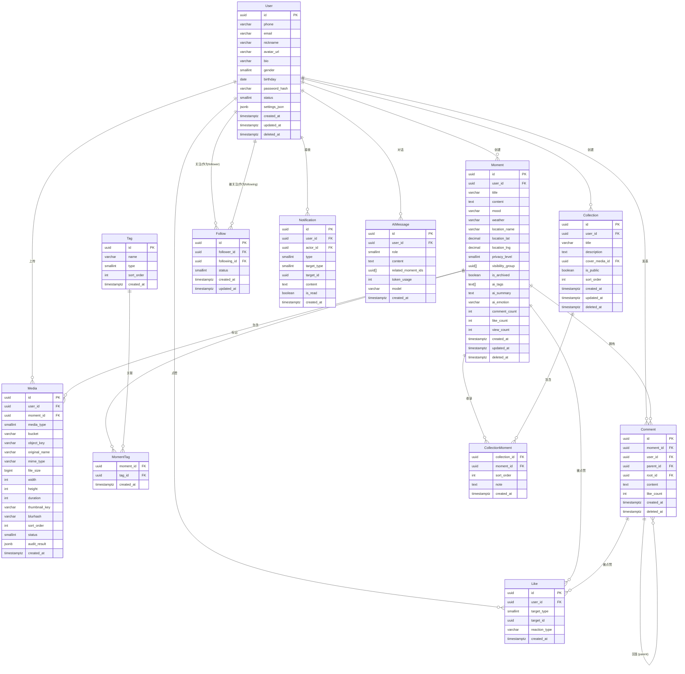

# ShengKe（生刻）数据模型

> 项目名称 **ShengKe** = **生刻**（生活的每个瞬间，都值得被生刻铭记）
> 社交日记产品 —— 记录时刻、分享生活、AI 赋能

---

## 设计原则

1. **软删除** —— 所有用户内容实体均包含 `deleted_at` 字段，物理删除仅在合规或数据清理时进行
2. **公共时间戳** —— 所有实体统一采用 `created_at` / `updated_at` / `deleted_at` 三件套
   - `updated_at` 在实体有明确更新语义时才存在（只读历史记录如 Media、Comment 等不设 `updated_at`）
   - 自动触发：业务层或 DB trigger 维护，推荐 `NOW()` 默认值 + 应用层更新
3. **主键统一使用 UUID v7** —— 时间有序，天然支持排序，避免自增 ID 暴露数据量
4. **分片标注** —— `user_id`、`moment_id` 等关键分片键在实体中明确标注，后续可基于这些字段做水平拆分
5. **JSONB 优先** —— 半结构化元数据使用 JSONB，避免频繁加列
6. **冗余缓存字段** —— 计数类字段（comment_count, like_count 等）在父实体冗余存储，由异步任务或 CQRS 更新保证最终一致性
7. **标准化索引** —— 主键查询、分片键范围查询、常用排序条件是索引标配

---

## 实体列表

### 1. User（用户）

| 字段 | 类型 | 约束 | 说明 |
|---|---|---|---|
| id | UUID | PK, UUID v7 | 用户唯一标识 |
| phone | VARCHAR(20) | UNIQUE, NOT NULL | 手机号登录 |
| email | VARCHAR(255) | UNIQUE | 邮箱（可选） |
| nickname | VARCHAR(50) | NOT NULL | 用户昵称 |
| avatar_url | VARCHAR(500) | | OSS 头像 URL |
| bio | VARCHAR(300) | | 个人简介 |
| gender | SMALLINT | DEFAULT 0 | 0:未知 1:男 2:女 |
| birthday | DATE | | |
| password_hash | VARCHAR(255) | NOT NULL | bcrypt 哈希 |
| status | SMALLINT | DEFAULT 1, NOT NULL | 1:正常 2:禁用 3:注销 |
| settings_json | JSONB | DEFAULT '{}' | 用户个性化设置 |
| created_at | TIMESTAMPTZ | NOT NULL, DEFAULT NOW() | |
| updated_at | TIMESTAMPTZ | NOT NULL, DEFAULT NOW() | |
| deleted_at | TIMESTAMPTZ | | 软删除时间 |

**索引：**
- `phone` UNIQUE（登录加速）
- `email` UNIQUE（登录加速）
- `created_at`（用户排序/管理）

**说明：** `deleted_at` 不为空时视为已注销用户，前端不再展示。phone 和 email 的唯一索引需在查询时附加 `deleted_at IS NULL` 条件。

---

### 2. Moment（生刻时刻）

| 字段 | 类型 | 约束 | 说明 |
|---|---|---|---|
| id | UUID | PK, UUID v7 | 时刻唯一标识 |
| user_id | UUID | FK → User.id, NOT NULL | 作者（分片键） |
| title | VARCHAR(200) | | 可选的标题 |
| content | TEXT | | 主内容（支持 Markdown） |
| mood | VARCHAR(20) | | 心情标签（开心/难过/…） |
| weather | VARCHAR(50) | | 天气信息 |
| location_name | VARCHAR(200) | | 位置名称 |
| location_lat | DECIMAL(10,7) | | GPS 纬度 |
| location_lng | DECIMAL(10,7) | | GPS 经度 |
| privacy_level | SMALLINT | DEFAULT 0, NOT NULL | 0:仅自己 1:部分好友 2:互关好友 3:公开 |
| visibility_group | UUID[] | | privacy_level=1 时可见的用户列表 |
| is_archived | BOOLEAN | DEFAULT FALSE | 归档（不进首页流） |
| ai_tags | TEXT[] | | AI 自动生成的标签 |
| ai_summary | TEXT | | AI 生成的摘要 |
| ai_emotion | VARCHAR(20) | | AI 情绪分析 |
| comment_count | INT | DEFAULT 0 | 评论数（冗余） |
| like_count | INT | DEFAULT 0 | 点赞数（冗余） |
| view_count | INT | DEFAULT 0 | 浏览数 |
| created_at | TIMESTAMPTZ | NOT NULL, DEFAULT NOW() | |
| updated_at | TIMESTAMPTZ | NOT NULL, DEFAULT NOW() | |
| deleted_at | TIMESTAMPTZ | | 软删除时间 |

**索引：**
- `(user_id, created_at DESC)` —— 用户个人时间线
- `(privacy_level, created_at DESC)` —— 公开 feed / 广场流
- `(ai_tags)` GIN —— AI 标签全文搜索
- `(created_at DESC)` —— 全局 feed 排序

**设计说明：**
- Moment 是社交日记的核心实体。user_id 是主要分片键，后续可按 user_id hash 分表。
- `privacy_level` + `visibility_group` 配合实现细粒度可见性控制。
- 冗余计数（comment_count, like_count）避免每次展示时 count 子表；通过事件总线异步更新。

---

### 3. Media（媒体文件）

| 字段 | 类型 | 约束 | 说明 |
|---|---|---|---|
| id | UUID | PK, UUID v7 | |
| user_id | UUID | FK → User.id, NOT NULL | 上传者（分片键） |
| moment_id | UUID | FK → Moment.id | 所属时刻（可为空，未关联则视为废弃/待清理） |
| media_type | SMALLINT | NOT NULL | 1:图片 2:视频 3:音频 |
| bucket | VARCHAR(100) | NOT NULL | OSS bucket 名称 |
| object_key | VARCHAR(500) | NOT NULL | OSS 对象路径 |
| original_name | VARCHAR(500) | | 原始文件名 |
| mime_type | VARCHAR(100) | | MIME 类型 |
| file_size | BIGINT | | 字节数 |
| width | INT | | 图片/视频宽度（像素） |
| height | INT | | 图片/视频高度（像素） |
| duration | INT | | 视频/音频时长（秒） |
| thumbnail_key | VARCHAR(500) | | 缩略图 OSS key |
| blurhash | VARCHAR(120) | | 占位图 hash（blurhash 编码） |
| sort_order | INT | DEFAULT 0 | 在 Moment 中的排序 |
| status | SMALLINT | DEFAULT 1 | 1:上传中 2:可用 3:审核失败 4:删除 |
| audit_result | JSONB | | 内容审核结果（鉴黄/暴恐/涉政） |
| created_at | TIMESTAMPTZ | NOT NULL, DEFAULT NOW() | |

**索引：**
- `(moment_id, sort_order)` —— Moment 内的媒体排序
- `(user_id)` —— 用户媒体库查询
- `(status)` —— 审核队列/清理任务

**设计说明：**
- moment_id 可为空，用于处理"上传中"的阶段；上传完成后再关联到 Moment。
- 内容审核由异步任务消费 audit_result，审核通过后才标记 status=2。
- sort_order 决定在 Moment 详情页中的展示顺序。

---

### 4. Tag（标签）

| 字段 | 类型 | 约束 | 说明 |
|---|---|---|---|
| id | UUID | PK, UUID v7 | |
| name | VARCHAR(50) | UNIQUE, NOT NULL | 标签名称 |
| type | SMALLINT | DEFAULT 0 | 0:用户自定义 1:AIGenerated 2:系统预设 |
| sort_order | INT | DEFAULT 0 | |
| created_at | TIMESTAMPTZ | NOT NULL, DEFAULT NOW() | |

**索引：**
- `name` UNIQUE

**设计说明：**
- Tag 是共享的全局词库，name 唯一。
- `type=1`（AI 生成）的标签会在 AI 分析 Moment 后自动创建，低频时可手动清理重复。
- `type=2`（系统预设）由运营配置，如#旅行日记、#读书笔记 等。

---

### 5. MomentTag（时刻-标签关联）

| 字段 | 类型 | 约束 | 说明 |
|---|---|---|---|
| moment_id | UUID | FK → Moment.id, NOT NULL | 时刻（分片键） |
| tag_id | UUID | FK → Tag.id, NOT NULL | 标签 |
| created_at | TIMESTAMPTZ | NOT NULL, DEFAULT NOW() | |

**主键：** `(moment_id, tag_id)` 联合主键

**设计说明：**
- 多对多关联表。无独立主键，使用联合主键。
- 无需分片，moment_id 上的索引自然支持按时刻查询标签。

---

### 6. Comment（评论）

| 字段 | 类型 | 约束 | 说明 |
|---|---|---|---|
| id | UUID | PK, UUID v7 | |
| moment_id | UUID | FK → Moment.id, NOT NULL | 所属时刻（分片键） |
| user_id | UUID | FK → User.id, NOT NULL | 评论者 |
| parent_id | UUID | FK → Comment.id | 父评论（非空时表示这是回复） |
| root_id | UUID | FK → Comment.id | 根评论 ID（快速拉取整个 nested thread） |
| content | TEXT | NOT NULL | 评论内容 |
| like_count | INT | DEFAULT 0 | |
| created_at | TIMESTAMPTZ | NOT NULL, DEFAULT NOW() | |
| deleted_at | TIMESTAMPTZ | | 软删除时间 |

**索引：**
- `(moment_id, created_at DESC)` —— 按时刻查评论列表
- `(user_id)` —— 用户的所有评论
- `(root_id)` —— 按根评论拉取 thread

**设计说明：**
- 支持两级嵌套（评论+回复），`parent_id` 指向父级评论。
- `root_id` 指向最顶层的根评论，方便一次查询拉出整个 thread。
- 删除评论时软删除，保留 `content` 为 `"[评论已被删除]"` 占位。
- Moment 表的 `comment_count` 通过异步事件更新。

---

### 7. Like / Reaction（点赞/反应）

| 字段 | 类型 | 约束 | 说明 |
|---|---|---|---|
| id | UUID | PK, UUID v7 | |
| user_id | UUID | FK → User.id, NOT NULL | 点赞者 |
| target_type | SMALLINT | NOT NULL | 1:Moment 2:Comment |
| target_id | UUID | NOT NULL | 被点赞对象的 ID |
| reaction_type | VARCHAR(20) | DEFAULT 'like' | like / love / laugh / sad / … |
| created_at | TIMESTAMPTZ | NOT NULL, DEFAULT NOW() | |

**唯一约束：** `(user_id, target_type, target_id)` —— 同一用户不能重复点赞同一对象

**索引：**
- `(target_type, target_id, created_at DESC)` —— 查询某个对象的点赞列表

**设计说明：**
- Like 与 Reaction 为同一实体，用 `reaction_type` 区分。
- 未来可扩展更多表情反应类型。
- 无软删除 —— 点赞是一种瞬时动作，取消时直接 DELETE（或使用 deleted_at 但罕见）。
- 父实体的 `like_count` 由异步事件更新。

---

### 8. Collection / Album（合集）

| 字段 | 类型 | 约束 | 说明 |
|---|---|---|---|
| id | UUID | PK, UUID v7 | |
| user_id | UUID | FK → User.id, NOT NULL | 创建者（分片键） |
| title | VARCHAR(100) | NOT NULL | 合集名称 |
| description | TEXT | | 合集描述 |
| cover_media_id | UUID | FK → Media.id | 封面媒体 |
| is_public | BOOLEAN | DEFAULT FALSE | 是否公开 |
| sort_order | INT | DEFAULT 0 | |
| created_at | TIMESTAMPTZ | NOT NULL, DEFAULT NOW() | |
| updated_at | TIMESTAMPTZ | NOT NULL, DEFAULT NOW() | |
| deleted_at | TIMESTAMPTZ | | 软删除时间 |

**索引：**
- `(user_id, sort_order)` —— 用户的合集列表

**设计说明：**
- Collection 相当于"专辑/相册"，用户可将多个 Moment 归类整理。
- `is_public` 控制是否展示在用户主页上。
- `cover_media_id` 可选；为空时取合集内 sort_order 最前的 Media。

---

### 9. CollectionMoment（合集-时刻关联）

| 字段 | 类型 | 约束 | 说明 |
|---|---|---|---|
| collection_id | UUID | FK → Collection.id, NOT NULL | 合集 |
| moment_id | UUID | FK → Moment.id, NOT NULL | 时刻 |
| sort_order | INT | DEFAULT 0 | 合集中的排序 |
| note | TEXT | | 合集中的个性化备注 |
| created_at | TIMESTAMPTZ | NOT NULL, DEFAULT NOW() | |

**主键：** `(collection_id, moment_id)` 联合主键

**设计说明：**
- Moment 可以属于多个 Collection。
- `note` 允许用户在合集中为同一个 Moment 添加不同上下文描述。

---

### 10. Follow / Connection（关注关系）

| 字段 | 类型 | 约束 | 说明 |
|---|---|---|---|
| id | UUID | PK, UUID v7 | |
| follower_id | UUID | FK → User.id, NOT NULL | 关注者 |
| following_id | UUID | FK → User.id, NOT NULL | 被关注者 |
| status | SMALLINT | DEFAULT 1 | 1:关注中 2:互关 3:已取消 |
| created_at | TIMESTAMPTZ | NOT NULL, DEFAULT NOW() | |
| updated_at | TIMESTAMPTZ | NOT NULL, DEFAULT NOW() | |

**唯一约束：** `(follower_id, following_id)`

**索引：**
- `(follower_id, created_at DESC)` —— 查询某人的关注列表
- `(following_id, created_at DESC)` —— 查询某人的粉丝列表

**设计说明：**
- 取消关注时 status=3（软删除），保留历史记录。
- 互关（status=2）影响 Feed 推荐权重和隐私可见性（Moment.privacy_level=2 时仅互关好友可见）。
- 此为无向关系简化（A→B 一条记录），互关状态由应用层判定：存在双向 status=1 的记录即为互关。

---

### 11. Notification（通知）

| 字段 | 类型 | 约束 | 说明 |
|---|---|---|---|
| id | UUID | PK, UUID v7 | |
| user_id | UUID | FK → User.id, NOT NULL | 接收者（分片键） |
| actor_id | UUID | FK → User.id | 触发者 |
| type | SMALLINT | NOT NULL | 1:点赞 2:评论 3:关注 4:@提及 5:系统 |
| target_type | SMALLINT | | 1:Moment 2:Comment 3:User |
| target_id | UUID | | 关联对象 ID |
| content | TEXT | | 通知预览内容（纯文本摘要） |
| is_read | BOOLEAN | DEFAULT FALSE | |
| created_at | TIMESTAMPTZ | NOT NULL, DEFAULT NOW() | |

**索引：**
- `(user_id, is_read, created_at DESC)` —— 未读通知列表

**设计说明：**
- Notification 是一个"写扩散"模式的实体：当 A 给 B 的 Moment 点赞时，系统插入一条 B 的通知记录。
- `actor_id` 可为空（系统通知如"您收到一枚周年徽章"）。
- 大量通知（如大 V 的粉丝通知）写入量大，建议按 `user_id` 分表。
- `is_read` 使用部分索引 `WHERE is_read = FALSE` 加速未读计数。

---

### 12. AIMessage（AI 对话记录）

| 字段 | 类型 | 约束 | 说明 |
|---|---|---|---|
| id | UUID | PK, UUID v7 | |
| user_id | UUID | FK → User.id, NOT NULL | 用户（分片键） |
| role | SMALLINT | NOT NULL | 1:user 2:assistant |
| content | TEXT | NOT NULL | 消息内容 |
| related_moment_ids | UUID[] | | 关联的 Moment 列表（AI 引用） |
| token_usage | INT | | Token 消耗（仅在 role=2 时有效） |
| model | VARCHAR(100) | | AI 模型名（仅在 role=2 时有效） |
| created_at | TIMESTAMPTZ | NOT NULL, DEFAULT NOW() | |

**索引：**
- `(user_id, created_at DESC)` —— 按用户查对话历史

**设计说明：**
- AIMessage 是用户与 AI 助手聊天的会话记录，每条消息独立存储（非嵌套 JSON）。
- `related_moment_ids` 记录 AI 在回答时引用的用户 Moment，用于前端展示"AI 提到了你的 X 条时刻"。
- 不含 `deleted_at`（AI 对话记录建议保留，可另设数据保留策略定时清理）。
- 后续可增加 `session_id` 字段以支持多轮会话分组。

---

## ER 关系图



---

## 迁移策略

### 工具选型

- **Alembic** 管理 PostgreSQL schema 变更
- 每次 PR 对应一个迁移文件，文件命名规范：`YYYY_MM_DD_HHMM_short_description.py`
- 迁移文件需要同时包含 `upgrade()` 和 `downgrade()`

### 安全变更规范

| 变更类型 | 策略 | 说明 |
|---|---|---|
| 新增表 | 直接 CREATE TABLE | 无影响 |
| 新增列（允许 NULL / 有默认值） | ALTER TABLE 直接执行 | 无锁 |
| 新增列（NOT NULL 无默认值） | 三步走：ADD COLUMN → 填充数据 → SET NOT NULL | 避免全表锁 |
| 新增索引 | CREATE INDEX CONCURRENTLY | 不阻塞读写 |
| 新增唯一约束 | 先创建部分唯一索引（WHERE deleted_at IS NULL），再 ADD CONSTRAINT | 避免重复数据冲突 |
| 删除索引 | DROP INDEX CONCURRENTLY | 不阻塞读写 |
| 修改列类型 | 创建新列 → 双写 → 数据迁移 → 切换 | 大表零停机 |
| 大表 DDL | 使用 pg_repack 或迁移工具（gh-ost for PG 类似方案） | 无锁 |

### 未来分表/分区策略

#### 方案 A：按 user_id 哈希分表（水平拆分）

适用于 Moment、Comment、Like、Notification 等核心大表。

```
moment_0  ...  moment_63
comment_0 ...  comment_63
like_0    ...  like_63
```

- 分片算法：`hash(user_id) % 64`
- 优点：均匀分布，单表数据量可控
- 缺点：跨分片查询（如"广场流/全站"）需要合并结果，或依赖搜索服务

#### 方案 B：按时间分区（范围分区）

适用于 Moment（按 created_at）、AIMessage（按 created_at）。

```sql
CREATE TABLE moment (
    ...
) PARTITION BY RANGE (created_at);

CREATE TABLE moment_2026_q1 PARTITION OF moment
    FOR VALUES FROM ('2026-01-01') TO ('2026-04-01');
CREATE TABLE moment_2026_q2 PARTITION OF moment
    FOR VALUES FROM ('2026-04-01') TO ('2026-07-01');
-- 每季度预创建
```

- 优点：查询可通过分区裁剪加速；旧分区可归档/压缩/只读
- 缺点：需要提前创建分区；分区数过多后性能下降

#### 推荐组合方案

- **Moment / Comment / Like / Notification**：按 `user_id` 哈希分 64 表（主分片），再辅以 `created_at` 索引
- **AIMessage**：按 `user_id` 哈希分 32 表
- **Media**：按 `user_id` 哈希分 32 表 + OSS 生命周期管理
- **Tag / MomentTag**：数据量小，无需分表
- **Collection / CollectionMoment**：数据量可控，无需分表
- **Follow**：按 `follower_id` 哈希分 32 表（关注列表为主场景）

> 注：初期可使用单表（PostgreSQL 单表千万级表现良好），待数据量达到亿级后再引入分表中间件（如 ShardingSphere-Proxy、Vitess 或应用层路由）。

---

## 附录：命名规范

| 项目 | 规范 |
|---|---|
| 表名 | 大驼峰首字母大写，单数：`User`, `Moment`, `Comment` |
| 列名 | snake_case：`user_id`, `created_at`, `privacy_level` |
| 主键 | `id` |
| 外键 | 引用表名 + `_id`：`moment_id`, `user_id` |
| 索引 | `ix_表名_字段名`（自动名称由 ORM/Alembic 生成，自定义可加前缀）|
| JSONB 字段 | 后缀 `_json` 或 `_jsonb`：`settings_json`, `audit_result` |
| 数组字段 | 后缀 `_list` 或明确类型后缀：`visibility_group`, `related_moment_ids` |
| 软删除字段 | `deleted_at`（TIMESTAMPTZ 类型，非空时表示已删除） |
| 时间戳 | `created_at`, `updated_at`, `deleted_at` |
