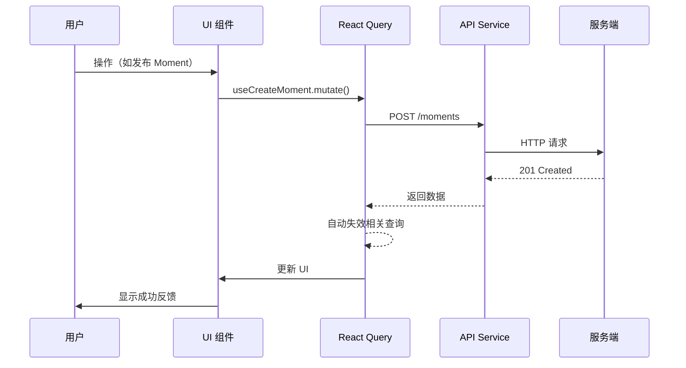
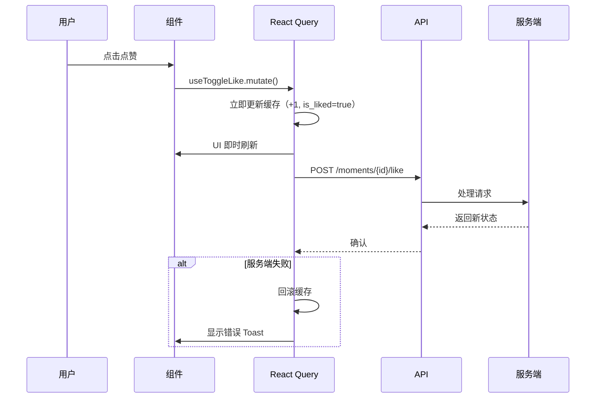
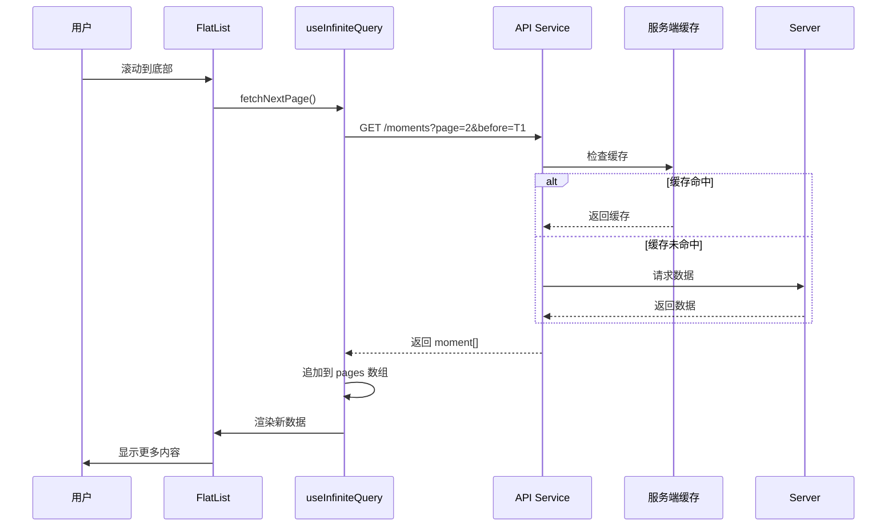
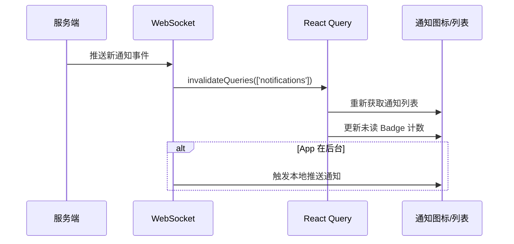

# ShengKe（生刻）前端组件架构

## 1. 技术栈

| 技术 | 用途 |
|------|------|
| **React Native (Expo SDK 51+)** | 跨平台移动端框架 |
| **TypeScript** | 类型安全 |
| **expo-router** | 文件系统路由 |
| **Zustand** | 客户端状态管理 |
| **TanStack Query (React Query)** | 服务端状态管理与缓存 |
| **expo-secure-store** | Token 安全存储 |
| **react-native-reanimated** | 高性能动画 |
| **react-native-gesture-handler** | 手势处理 |

**选型理由:**

- **Expo** 而非 RN CLI — 减少原生配置开销，OTA 更新支持，生态成熟
- **Zustand + React Query** 而非 Redux — 更少的样板代码，天然分离客户端状态与服务端状态，React Query 自动处理缓存失效、后台刷新、乐观更新
- **expo-router** 而非 React Navigation 直接使用 — 文件路由约定减少路由配置，Web 兼容性好

---

## 2. 目录结构

```
src/
├── app/                    # expo-router 页面路由（文件系统路由）
│   ├── (auth)/             # 未登录路由组（重定向到这里）
│   │   ├── _layout.tsx     # Auth 布局（居中卡片式）
│   │   ├── login.tsx       # 登录页
│   │   ├── register.tsx    # 注册页
│   │   └── reset-password.tsx  # 重置密码
│   ├── (tabs)/             # 主 Tab 路由组（已登录）
│   │   ├── _layout.tsx     # Tab 导航布局
│   │   ├── home/           # 首页 Feed
│   │   │   ├── _layout.tsx
│   │   │   ├── index.tsx   # Feed 流
│   │   │   └── [id].tsx    # Moment 详情页
│   │   ├── explore/        # 发现/广场
│   │   ├── create/         # 发布生刻
│   │   ├── notifications/  # 通知列表
│   │   └── profile/        # 个人主页
│   ├── _layout.tsx         # 根布局（AuthProvider + QueryClientProvider）
│   └── +not-found.tsx      # 404 页面
│
├── components/             # 可复用 UI 组件
│   ├── common/             # 通用 UI：Button, Input, Avatar, Card 等
│   ├── moment/             # Moment 相关：MomentCard, MomentComposer 等
│   ├── user/               # 用户相关：UserCard, ProfileHeader 等
│   ├── media/              # 媒体组件：ImageViewer, VideoPlayer 等
│   ├── social/             # 社交互动：CommentList, LikeButton 等
│   └── ai/                 # AI 功能组件：AIChatBubble, MoodChart 等
│
├── stores/                 # Zustand stores（客户端状态）
│   ├── authStore.ts        # Token / 登录状态
│   ├── uiStore.ts          # 主题 / Toast / BottomSheet 队列
│   ├── draftStore.ts       # 未发布 Moment 草稿
│   └── filterStore.ts      # Feed 筛选条件
│
├── hooks/                  # 自定义 hooks
│   ├── useAuth.ts          # 认证相关
│   ├── useMomentFeed.ts    # Feed 流（基于 React Query infinite query）
│   ├── useImagePicker.ts   # 图片选择与压缩
│   └── useNotifications.ts # 通知与未读管理
│
├── services/               # API 调用层
│   ├── client.ts           # Axios 实例（拦截器、Token 刷新）
│   ├── auth.ts             # 认证 API
│   ├── moments.ts          # Moment CRUD API
│   ├── media.ts            # 媒体上传 API
│   ├── social.ts           # 评论/点赞 API
│   ├── ai.ts               # AI 功能 API
│   └── notifications.ts    # 通知 API
│
├── types/                  # TypeScript 类型定义
│   ├── api.ts              # API 请求/响应类型
│   ├── models.ts           # 数据模型类型（User, Moment, Media...）
│   └── navigation.ts       # 路由参数类型
│
├── utils/                  # 工具函数
│   ├── format.ts           # 日期/数字格式化
│   ├── storage.ts          # SecureStore 封装
│   └── validation.ts       # 表单验证
│
├── constants/              # 常量配置
│   ├── theme.ts            # 主题色/字号/间距
│   ├── config.ts           # API baseURL 等环境配置
│   └── emotions.ts         # 心情/Emoji 映射表
│
└── assets/                 # 静态资源
    ├── fonts/
    ├── images/
    └── animations/
```

---

## 3. 页面路由结构 (expo-router)

| 路由路径 | 页面组件 | 说明 |
|----------|---------|------|
| `/login` | `LoginScreen` | 手机号密码登录 |
| `/register` | `RegisterScreen` | 手机号注册 + 验证码 |
| `/reset-password` | `ResetPasswordScreen` | 重置密码 |
| `/(tabs)/home` | `HomeFeedScreen` | 首页订阅 Feed 流 |
| `/(tabs)/home/[id]` | `MomentDetailScreen` | Moment 详情（含评论） |
| `/(tabs)/explore` | `ExploreScreen` | 广场/发现 |
| `/(tabs)/create` | `CreateMomentScreen` | 发布生刻 |
| `/(tabs)/notifications` | `NotificationScreen` | 通知列表 |
| `/(tabs)/profile` | `ProfileScreen` | 个人主页 |
| `/profile/edit` | `EditProfileScreen` | 编辑个人资料 |
| `/profile/settings` | `SettingsScreen` | 设置页 |
| `/profile/collections` | `MyCollectionsScreen` | 我的合集列表 |
| `/profile/collections/[id]` | `CollectionDetailScreen` | 合集详情 |
| `/user/[id]` | `UserProfileScreen` | 他人主页 |
| `/user/[id]/moments` | `UserMomentsScreen` | 他人的时刻列表 |
| `/moments/[id]/edit` | `EditMomentScreen` | 编辑时刻 |
| `/moments/[id]/viewers` | `MomentViewersScreen` | 可见用户管理 |
| `/ai/chat` | `AIChatScreen` | AI 陪伴对话（流式） |
| `/ai/mood-report` | `MoodReportScreen` | 情绪分析报告 |

---

## 4. 核心组件拆分

### 4.1 common/ — 通用 UI 组件

| 组件 | 职责 |
|------|------|
| **Button** | 主按钮 / 次要按钮 / 文字按钮，加载态、禁用态 |
| **Input** | 文本输入框，支持密码、验证码格式 |
| **Avatar** | 用户头像显示，支持 fallback 首字母 |
| **Card** | 卡片容器，可选阴影、圆角、点击反馈 |
| **Badge** | 角标（未读数/新内容提示） |
| **EmptyState** | 空状态占位（无内容/无网络/无结果） |
| **LoadingSpinner** | 加载指示器 |
| **Toast** | 轻提示（成功/错误/信息） |
| **ConfirmationModal** | 确认弹窗（删除确认/操作确认） |
| **BottomSheet** | 底部弹出面板（分享/选择） |
| **IconButton** | 图标按钮 |
| **SegmentedControl** | 分段选择器 |
| **SwipeableRow** | 可滑动行（左滑删除/操作） |

### 4.2 moment/ — 生刻相关组件

| 组件 | 职责 |
|------|------|
| **MomentCard** | Feed 流中的卡片：媒体预览 + 截断内容 + 互动按钮（点赞/评论/分享） |
| **MomentDetail** | 完整 Moment 视图：全部内容 + 全部媒体 + AI 摘要 块 |
| **MomentComposer** | 富文本编辑器：支持 Markdown 快捷键、@提及、插入标签 |
| **MomentPrivacySelector** | 隐私级别选择器：仅自己/部分好友/互关/公开，含用户搜索选择 |
| **MediaGrid** | 媒体网格展示：1/2/3/4 及 4+ 布局自适应 |
| **MoodSelector** | 心情选择器：Emoji 网格选择 |
| **LocationPicker** | 位置选择：搜索 POI + 当前位置 + 手动输入 |

### 4.3 user/ — 用户相关组件

| 组件 | 职责 |
|------|------|
| **UserCard** | 用户信息卡片：头像 + 昵称 + 简介 + 关注按钮 |
| **UserList** | 可滚动用户列表（关注/粉丝列表） |
| **ProfileHeader** | 个人主页头部：头像、统计（时刻/粉丝/关注）、Bio、编辑按钮 |
| **AvatarPicker** | 头像选择：拍照/相册选择 + 裁剪 + 压缩上传 |

### 4.4 social/ — 社交互动组件

| 组件 | 职责 |
|------|------|
| **CommentList** | 树形评论列表：嵌套回复缩进显示，支持加载更多 |
| **CommentItem** | 单条评论：头像 + 内容 + 时间 + 点赞按钮 |
| **CommentComposer** | 评论输入框：@回复提示、发送按钮 |
| **LikeButton** | 点赞按钮：心形动画、数字计数、点赞态切换 |
| **ReactionPicker** | Reaction 选择：love/laugh/sad/wow 浮动面板 |
| **FollowButton** | 关注/取消按钮：状态切换 + 确认弹窗 |
| **ShareSheet** | 分享面板：分享到 IM / 生成海报 / 复制链接 / 保存图片 |

### 4.5 media/ — 媒体组件

| 组件 | 职责 |
|------|------|
| **ImageViewer** | 图片查看器：捏合缩放、双指平移、双击切换 |
| **VideoPlayer** | 视频播放器：Expo AV 封装、播放/暂停、进度条、全屏 |
| **MediaCarousel** | 媒体轮播：左右滑动切换、指示器、视频自动暂停 |
| **AudioRecorder** | 录音组件：录制/播放/波形显示 |
| **BlurhashPlaceholder** | 模糊占位：blurhash 解码渲染，渐进式加载过渡 |

### 4.6 ai/ — AI 功能组件

| 组件 | 职责 |
|------|------|
| **AIChatBubble** | AI 对话气泡：消息角色区分、时间戳、文本+引用块 |
| **TagSuggestion** | 标签建议条：横向滚动标签建议 + 点击添加 |
| **MoodChart** | 情绪趋势图：折线图/柱状图，周/月/年维度 |
| **AISummaryCard** | AI 摘要卡片：折叠/展开、编辑反馈（好/差评） |
| **AIMoodIndicator** | 情绪指示器：小图标 + 文字，显示当下情绪 |

---

## 5. 状态管理方案

### 5.1 选型：Zustand + TanStack Query

**为什么不用 Redux?**
- Redux 的 action/reducer 模式对这类项目过于沉重
- 大部分「数据」实际来自服务端（Moment/User/Comment），用 React Query 管理缓存天然更优
- Zustand 230 bytes（gzip），Redux Toolkit ~11KB，没必要

**为什么不用 SWR 替代 React Query?**
- React Query 对 Infinite Query（无限滚动 Feed）支持更好
- 乐观更新（optimistic update）API 更清晰
- DevTools 生态更成熟

### 5.2 Zustand Stores（客户端状态）

**useAuthStore:**
```typescript
interface AuthState {
  token: string | null;
  refreshToken: string | null;
  user: User | null;
  isAuthenticated: boolean;
  login: (phone: string, password: string) => Promise<void>;
  logout: () => void;
  refreshAccessToken: () => Promise<void>;
}
```

**useUIStore:**
```typescript
interface UIState {
  theme: 'light' | 'dark';
  toastQueue: Toast[];
  bottomSheet: BottomSheetConfig | null;
  showToast: (toast: Toast) => void;
  showBottomSheet: (config: BottomSheetConfig) => void;
}
```

**useDraftStore:**
```typescript
interface DraftState {
  drafts: Record<string, DraftMoment>;
  currentDraftId: string | null;
  saveDraft: (draft: DraftMoment) => void;
  clearDraft: (id: string) => void;
  getCurrentDraft: () => DraftMoment | null;
}
```

### 5.3 React Query 查询/变更

**Queries:**
```typescript
// Feed 流 — Infinite Query
useMomentsFeed(type: 'home' | 'explore', options?: { tag?: string })

// 单条详情
useMomentDetail(id: string)

// 评论列表（带树形结构）
useMomentComments(momentId: string, sort?: 'latest' | 'oldest')

// 用户资料
useUserProfile(userId: string)

// 用户时刻列表
useUserMoments(userId: string, page: number)

// 通知
useNotifications(unreadOnly?: boolean)

// 合集
useUserCollections(userId: string)
useCollectionDetail(collectionId: string)

// 搜索
useSearch(query: string, type: 'moments' | 'users', page: number)
```

**Mutations:**
```typescript
useCreateMoment()     // -> POST /moments
useUpdateMoment()     // -> PATCH /moments/{id}
useDeleteMoment()     // -> DELETE /moments/{id}
useCreateComment()    // -> POST /moments/{id}/comments
useToggleLike()       // -> POST /moments/{id}/like（乐观更新）
useFollowUser()       // -> POST /users/{id}/follow（乐观更新）
useCreateCollection() // -> POST /collections
useArchiveMoment()    // -> POST /moments/{id}/archive
```

---

## 6. 导航设计

### 6.1 Tab 导航结构

```
底部 Tab 导航
├── 📋 首页 (home)       → HomeFeedScreen
│   ├── Stack: Moment Detail
│   └── Stack: Moment Edit
├── 🔍 发现 (explore)    → ExploreScreen
│   └── Stack: Moment Detail
├── ✏️ 发布 (create)     → CreateMomentScreen（居中凸起按钮）
├── 🔔 通知 (notif.)     → NotificationScreen
│   └── Stack: Moment Detail / User Profile
└── 👤 我的 (profile)    → ProfileScreen
    ├── Stack: 编辑资料
    ├── Stack: 设置
    ├── Stack: 我的合集
    │   └── Stack: 合集详情
    └── Stack: 点赞列表
```

### 6.2 嵌套 Stack 关系

```ascii
根 Stack
├── (auth) Stack — 未登录
│   ├── Login
│   ├── Register
│   └── ResetPassword
│
└── (tabs) Stack — 已登录
    ├── Tab: Home
    │   ├── HomeFeed
    │   └── MomentDetail ←─── 跨 Stack 复用
    │       ├── MomentEdit
    │       └── MomentViewers
    ├── Tab: Explore
    │   ├── Explore
    │   └── MomentDetail (同组件)
    ├── Tab: Create
    │   └── CreateMoment
    ├── Tab: Notifications
    │   ├── NotificationList
    │   └── MomentDetail / UserProfile
    └── Tab: Profile
        ├── Profile
        ├── EditProfile
        ├── Settings
        ├── MyCollections
        │   └── CollectionDetail
        ├── LikedMoments
        └── AI Chat / MoodReport
```

---

## 7. 数据流

### 7.1 标准读写流程



### 7.2 乐观更新（点赞）



### 7.3 Feed 流无限滚动



### 7.4 WebSocket 实时通知



---

## 8. 性能考量

### 8.1 列表优化

- **FlatList 虚拟化：** Feed 流和评论列表均使用 FlatList，设置 `windowSize=10`、`maxToRenderPerBatch=5`
- **Item 缓存：** `keyExtractor` 使用 UUID，`React.memo` 包装 MomentCard/CommentItem
- **getItemLayout：** 对于等高的卡片可以设置，但 MomentCard 高度不一，改用 `cellRendererComponent` 优化

### 8.2 图片优化

- **Blurhash 占位：** 大图加载前显示模糊占位，解码在原生线程
- **渐进加载：** `expo-image` 的 `placeholder={{ blurhash }}` + `contentFit="cover"`
- **缩略图优先：** Feed 中优先加载 `thumbnail_url`（OSS 图片处理压缩），详情页加载原图
- **预加载：** 预测用户滑向下一条时，提前 preload 相邻图片

### 8.3 动画优化

- **Reanimated 2：** 点赞动画、Tab 切换、BottomSheet 手势驱动动画跑在 UI 线程
- **Gesture Handler：** 滑动删除、图片缩放手势由原生手势处理器接管
- **LayoutAnimation：** React Native 内置的列表插入/删除过渡动画

### 8.4 缓存策略

- **React Query staleTime：**
  - Feed 列表：30 秒
  - Moment 详情：5 分钟（写后失效）
  - 用户资料：10 分钟
  - 通知列表：15 秒（高频刷新）
- **gcTime（原 cacheTime）：** 默认 5 分钟，导航回来时可复用
- **本地持久化：** 使用 `@tanstack/query-async-storage-persister` 将查询缓存持久化到 AsyncStorage，App 冷启动时快速展示

### 8.5 启动优化

- **缓加载：** AI 相关组件（AIChatBubble, MoodChart）通过 `React.lazy` + Suspense 延迟加载
- **bundle 分包：** expo-updates 配置分模块加载
- **字体预加载：** `useFonts` 在根布局中预加载，避免文字闪烁
